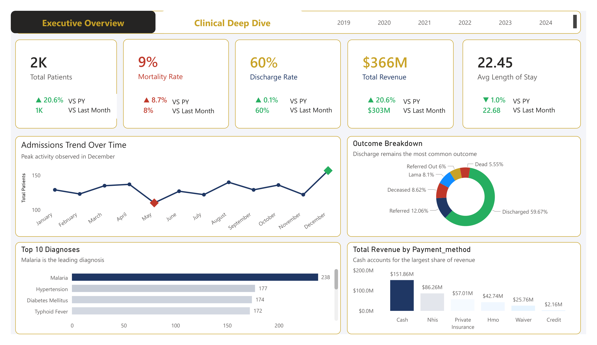
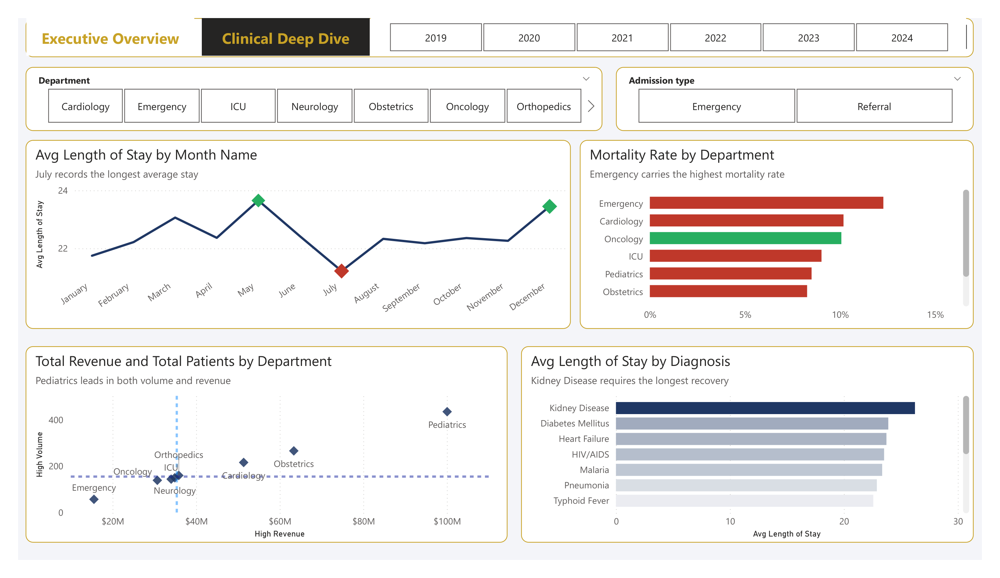

# 🏥 Hospital Patient Records Dashboard

## Dashboard Preview

### Page 1 — Executive Overview

### Page 2 — Clinical Deep Dive

---

## Overview
An end-to-end business intelligence solution built on a 
synthetic hospital dataset of 9,500 patient records. 
This two-page interactive Power BI dashboard delivers 
executive-level clinical, operational, and financial 
insights — enabling data-driven decision-making across 
hospital leadership, clinical directors, and operations 
management.

---

## Business Problem
Hospital leadership lacked a unified view of patient 
outcomes, departmental performance, and revenue trends. 
Critical questions remained unanswered:

- Which departments carry the highest mortality risk?
- What diagnoses drive the longest patient stays?
- Which payment channels generate the most revenue?
- When does patient admission volume peak?

This dashboard was built to answer all of them.

---

## Dashboard Structure

### Page 1 — Executive Overview
High-level KPI summary designed for C-suite and senior 
leadership consumption.

| KPI | Value | YoY Change |
|---|---|---|
| Total Patients | 2,000 | ▲ 20.6% |
| Mortality Rate | 9% | ▲ 8.7% |
| Discharge Rate | 60% | ▲ 0.1% |
| Total Revenue | $366M | ▲ 20.6% |
| Avg Length of Stay | 22.45 days | ▼ 1.0% |

**Visuals included:**
- Admissions Trend Over Time (monthly line chart)
- Outcome Breakdown (donut chart)
- Top 10 Diagnoses by Volume (bar chart)
- Total Revenue by Payment Method (bar chart)

---

### Page 2 — Clinical Deep Dive
Operational and clinical analysis designed for department 
heads, clinical directors, and operations managers.

**Visuals included:**
- Avg Length of Stay by Month (annotated line chart)
- Mortality Rate by Department (conditional bar chart)
- Total Revenue vs Total Patients by Department (scatter plot)
- Avg Length of Stay by Diagnosis (bar chart)

---

## Key Findings
- **December** is the peak admission month — staffing 
  and bed capacity planning should account for this 
  annual surge
- **Emergency department** carries the highest mortality 
  rate at ~13% — requires immediate clinical review
- **Kidney Disease** drives the longest average patient 
  recovery time across all diagnoses
- **Pediatrics** leads all departments in both patient 
  volume and revenue generation
- **Cash payments** account for $151.86M — over-reliance 
  on out-of-pocket payments creates revenue risk
- **Malaria** is the single largest admission driver 
  with 238 cases — more than Hypertension and Diabetes 
  combined

---

## Data Pipeline
Raw Data (9,500 rows messy synthetic dataset)

↓

Power Query — Cleaning, standardisation,

null handling, data type correction

↓

Star Schema — Fact and dimension table modelling

↓

DAX Measures — KPI calculations, YoY comparisons,

VS Last Month variance

↓

Power BI Dashboard — Two-page interactive report

---
---

## Tools & Technologies
| Tool | Purpose |
|---|---|
| Power BI Desktop | Dashboard development and visualisation |
| Power Query (M) | Data cleaning and transformation |
| DAX | KPI measures and time intelligence |
| Star Schema | Data modelling |
| SQL Server | Supplementary data querying |

---

## Repository Structure
Hospital-Patient-Records-Dashboard/

├── README.md

├── Hospital_Patient_Records.pbix

└── screenshots/

├── page1_executive_overview.png

└── page2_clinical_deep_dive.png

---
---

## Key Findings
- **December** is the peak admission month
- **Emergency** carries the highest mortality at ~13%
- **Kidney Disease** drives the longest recovery time
- **Pediatrics** leads in volume and revenue
- **Cash** dominates payment at $151.86M
- **Malaria** is the top diagnosis at 238 cases

---
---

## Strategic Recommendations

### Clinical & Patient Safety
- **Emergency Department Review** — With a ~13% mortality 
  rate, Emergency requires an immediate clinical audit. 
  Staffing levels, triage protocols, and equipment 
  availability should all be assessed as priority actions.

- **Kidney Disease Care Protocol** — Kidney Disease drives 
  the longest average recovery time across all diagnoses. 
  A dedicated nephrology care pathway should be explored 
  to reduce length of stay and improve patient outcomes.

- **Infectious Disease Preparedness** — Malaria dominates 
  admissions at 238 cases. The hospital should invest in 
  seasonal prevention programmes and ensure adequate 
  antimalarial medication stock year-round.

---

### Operational Efficiency
- **December Surge Planning** — Admissions peak every 
  December without exception. The hospital should implement 
  a seasonal capacity plan covering additional bed 
  allocation, locum staffing, and supply chain readiness 
  at least 6 weeks before December each year.

- **July Length of Stay Investigation** — May records the 
  longest average patient stay. A deeper diagnostic drill 
  is recommended to identify whether this is driven by 
  case complexity, staffing gaps, or discharge delays.

- **Pediatrics Expansion** — Pediatrics leads all 
  departments in both patient volume and revenue. Capital 
  investment in expanding Pediatrics capacity would 
  directly impact both clinical throughput and financial 
  performance.

---

### Financial & Revenue
- **Payment Method Diversification** — Cash accounts for 
  $151.86M of total revenue — nearly double the next 
  channel. Over-reliance on out-of-pocket payments creates 
  significant revenue risk if patient volume declines. 
  The hospital should actively drive NHIS and HMO 
  enrolment among its patient base.

- **Low Revenue Department Review** — Emergency sits in 
  the bottom left quadrant of the Revenue vs Volume 
  scatter — high mortality, low revenue. A cost-benefit 
  analysis of Emergency department operations is 
  recommended to assess sustainability.

- **Revenue Growth Sustainability** — Total revenue grew 
  20.6% YoY to $366M. However, with mortality also rising 
  8.7% YoY, growth must not come at the expense of care 
  quality. A balanced scorecard approach is recommended 
  going forward.

---

## Conclusion

This dashboard was built to do one thing — turn 9,500 rows 
of messy hospital data into decisions.

The findings tell a clear story:

The hospital is growing. Patient volume is up. Revenue is 
up. But growth is masking serious clinical risks — a 9% 
mortality rate rising year on year, an Emergency department 
under pressure, and a dangerous over-reliance on cash 
payments.

A dashboard that only celebrates the green numbers is not 
a BI tool. It is a vanity report.

This one surfaces the red numbers too — because that is 
where the real decisions live.

**Built end-to-end using:**
Power BI · DAX · Power Query · Star Schema · SQL Server

---

*This project was built as part of an end-to-end portfolio 
demonstration of data analytics and business intelligence 
skills — from raw messy data to executive-ready insight.*
---
## Author
**Omobolaji Kehinde Zachariah**
Data Analyst | BI Specialist
🔗 [GitHub Portfolio](https://komobolaji20-droid.github.io)
🔗 [LinkedIn](https://linkedin.com/in/your-linkedin-here)
